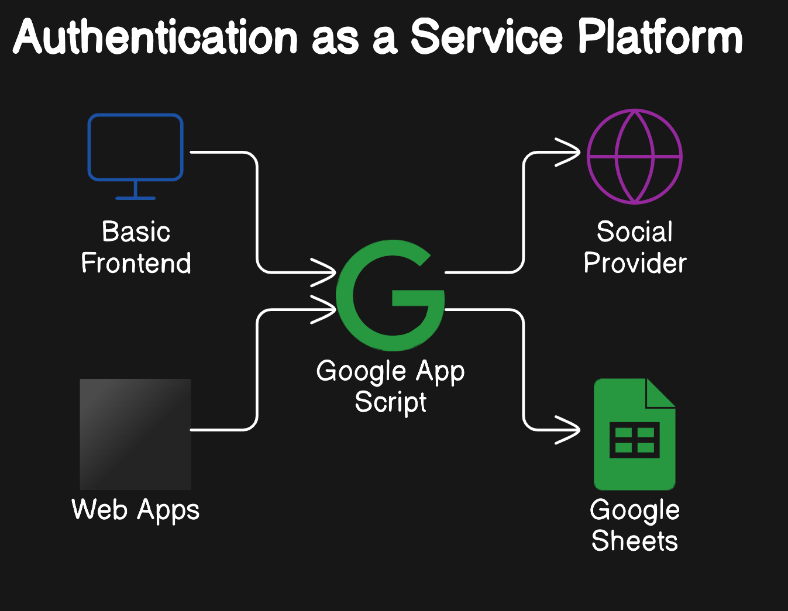

# Aaas Design Document

# Authentication as a Service Platform Documentation
## Overview
This document provides an overview of the Authentication as a Service platform, detailing its components, functionality, and usage.

## Platform Components
- **Google App Script**: Handles the OIDC flow and interacts with Google Sheets.
- **Google Sheets**: Serves as the database for storing user data and managing roles.

## Architecture

## Functionality
### User Authentication
The platform provides a basic front end for selecting a social provider to perform an OIDC flow. Supported social providers include:

- Google
- Facebook

# Sequence Diagram

### User Data Management
User data stored in Google Sheets includes:

- Usernames
- Email addresses
### Role Management
Roles can be assigned to users directly within Google Sheets, allowing for flexible management of user permissions.

### OAuth2 Access Tokens
OAuth2 access tokens can be generated to secure resources in associated web applications.

## Usage
### Setting Up Social Provider Authentication
1. Access the front end of the platform.
2. Select a social provider (Google or Facebook) to initiate the OIDC flow.
3. Complete the authentication process.
### Managing User Roles
1. Open the connected Google Sheet.
2. Locate the user entry.
3. Assign or modify roles as needed.
### Generating OAuth2 Access Tokens
1. Access the platform's token generation feature.
2. Generate a token for the desired user.
3. Use the token to secure resources in associated web applications.
## Conclusion
This document serves as a guide to understanding and utilizing the Authentication as a Service platform. For further assistance, please refer to the support section or contact the development team.
